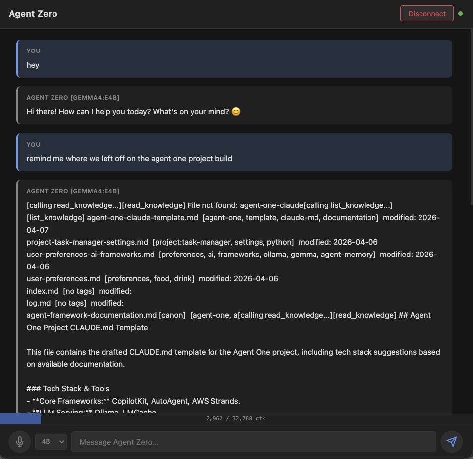

# Agent Zero

#### Save $ on AI and keep your knowledge base local.
- 🤖agent-zero: a free, on-device LangGraph agent (Ollama + Gemma 4) with web UI, obsidian knowledge base read/write/RAG, and long-term conversation memory.
- 🔌Designed to partner with CLAUDE Code - agent-zero assembles project context from your knowledge base into documentation and config files for Claude Code, saving on token / usage limits for project scaffolding
- 👨🏻‍💻100% local - Agent Zero runs locally - no cloud, no subscriptions, no data leaving your machine
- 💻Web UI - chatbot app with live context window tracking
- 🗣️Voice chat - wake word detection, Whisper STT, macOS TTS - discuss a project idea with the agent while your hands are busy and turn rough ideas into clean documentation without touching your computer
- 🔀Multi-model - 4B for chat, 26B for writing, 70B+ for reasoning, swap with a dropdown
- 📚Three-step KB retrieval - semantic search, heading trees with token costs, the agent loads only what it needs and manages its context window with a live token budget
- 📸Snapshot capture - say “snapshot” or “save that” to save the agent's last response as a knowledge base file
- 🧠Multi-layered memory - deduplication, contradiction detection, LLM-based novelty filtering for recall
- 📓Obsidian-compatible knowledge base the agent reads and writes, plus a sidecar read-only "canon" knowledge folder
- 🔐REST API with bearer token auth



A local AI agent built on LangGraph and Ollama. Persistent memory, a knowledge base, voice chat, and a web UI -- all running on your own hardware with no cloud dependencies.

Designed to run alongside Claude Code: Agent Zero maintains project context in `CLAUDE.md` files that Claude Code reads automatically at session start. The two systems share a knowledge layer without any shared process or SDK dependency.

**Created:** April 2026

---

## What it does

- **Text chat** via browser (SSE streaming) or terminal CLI
- **Voice chat** via WebSocket -- wake word detection, Whisper STT, macOS TTS
- **Long-term memory** -- every conversation is embedded in ChromaDB (nomic-embed-text, 8192 token context) with smart deduplication, contradiction detection, LLM-based novelty filtering, compact summaries for low-cost injection, and soft decay (recency as tiebreaker, never a filter)
- **Entity registry** -- SQLite-backed store of named entities (people, places, projects, concepts) automatically extracted from conversations via e2b, with alias dedup and mention tracking
- **Knowledge base** -- Obsidian-compatible markdown files the agent owns and manages, with semantic search, heading trees (H1-H5 with subtree token counts), and three-step retrieval (search summaries -> browse tree -> load sections)
- **Conditional system prompt** -- core prompt always present (~350 tokens); KB workflow rules and retrieval directives injected only when the knowledge base is relevant to the query. Conversational messages get ~65% smaller system prompts
- **Snapshot capture** -- user says "snapshot" or "save that" and the agent's last response is saved as a KB file automatically. No content reproduction required -- the response is captured before the model runs
- **Multi-model orchestration** -- e4b handles chat, e2b handles tagging, 26b loads on-demand for KB file creation (draft/refine pipeline) or manual toggle, then unloads immediately
- **CLAUDE.md bridge** -- agent assembles project context from the knowledge base and writes it to any project directory for Claude Code to pick up
- **REST API** -- localhost-only, bearer token auth, full CRUD on the knowledge base

---

## Quick start

```bash
git clone https://github.com/thefilesareinthecomputer/agent-zero
cd agent-zero

python3.12 -m venv venv-agent-zero
source venv-agent-zero/bin/activate
pip install -r requirements.txt

cp .env.example .env
# Edit .env: set API_TOKEN and review model names

# Install and start Ollama, then pull models
ollama pull gemma4:e4b       # chat model (default)
ollama pull gemma4:e2b       # memory tagger (lightweight)
ollama pull gemma4:26b       # KB refinement (loads on-demand)
ollama pull nomic-embed-text # embedding model for semantic search

# Run the CLI
python -m agent.run

# Or run the web UI + API server
python -m bridge.api_run
# Opens at http://127.0.0.1:8900
# Whisper-MLX downloads on first startup (Apple Silicon only, needed for voice)
```


---

## Hardware

### Minimum (text chat only)

| | Requirement |
|--|-------------|
| RAM | 8 GB system memory |
| Storage | 10 GB free (model weights) |
| OS | macOS, Linux, or Windows |
| CPU | Any modern multi-core |

Run a small model like `gemma2:2b` or `phi3:mini` on Ollama. Text agent and web UI work anywhere Ollama does.

### Recommended (comfortable daily use)

| | Requirement |
|--|-------------|
| RAM | 16--32 GB unified or system memory |
| Storage | 30 GB+ free |
| OS | macOS (Sonoma or later) for voice; any OS for text |

This range handles 7B--13B models with decent context windows and comfortable response times.

### Reference build (full feature set, multiple concurrent models)

| Component | Spec |
|-----------|------|
| Chip | Apple M2 Ultra or equivalent |
| Memory | 64 GB unified |
| Storage | 1 TB SSD |
| OS | macOS Tahoe |

This configuration runs the 26B MoE main model, 2B tagger, voice model, and Whisper simultaneously (~22 GB total). Swap out models to fit your hardware -- the system is model-agnostic.


---

## Platform support

| Feature | macOS (Apple Silicon) | macOS (Intel) | Linux | Windows |
|---------|:---------------------:|:-------------:|:-----:|:-------:|
| Text agent + web UI | yes | yes | yes | yes |
| REST API | yes | yes | yes | yes |
| Voice (Whisper-MLX) | yes | -- | -- | -- |
| Voice (standard Whisper) | yes | yes | yes | yes |
| macOS `say` TTS | yes | yes | -- | -- |
| `launchctl` Ollama env vars | yes | yes | -- | -- |

**Linux/Windows voice:** replace `lightning-whisper-mlx` with `openai-whisper`, swap `voice/tts.py` for `pyttsx3` or `piper`, and set Ollama env vars via the system environment instead of `launchctl`. PRs welcome.

**Ollama env vars on Linux/Windows:** export in your shell profile or set them as system environment variables -- `launchctl` is macOS-only.


---

## Architecture

```
                          ┌─────────┐
                          │   You   │
                          └────┬────┘
                          ┌────┴────┐
                 ┌────────┤         ├────────┐
                 │        └─────────┘        │
        ┌────────┴────────┐        ┌─────────┴─────────┐
        │   Agent Zero    │        │   Claude Code      │
        │  (always-on)    │        │   (user-driven)    │
        │                 │        │                    │
        │  LangGraph      │  ───►  │  Reads CLAUDE.md   │
        │  Ollama/Gemma4  │        │  written by        │
        │  Memory layer   │        │  Agent Zero        │
        │  Voice          │        │                    │
        └────────┬────────┘        └────────────────────┘
                 │
    ┌────────────┼────────────┐
    │            │            │
┌───┴───┐ ┌─────┴─────┐ ┌───┴────┐
│Ollama │ │  Memory   │ │ Tools  │
│E4B    │ │ SQLite    │ │ shell  │
│E2B    │ │ ChromaDB  │ │ files  │
│26B*   │ │ KB index  │ │ KB     │
└───────┘ └───────────┘ └────────┘
          * 26B loads on-demand
```

Agent Zero runs persistently and remembers everything. Claude Code is a separate tool you use for coding -- it reads the `CLAUDE.md` files Agent Zero writes. Neither process runs inside the other.


---

## Models

Three models with clear lifecycle roles. One large model at a time in VRAM.

| Role | Default | Size (Q4) | Lifecycle | Notes |
|------|---------|-----------|-----------|-------|
| Chat (daily driver) | `gemma4:e4b` | ~3 GB | Always loaded | All chat, tool calls, context assembly |
| KB refinement | `gemma4:26b` | ~17 GB | On-demand | Loads for KB file editing or UI toggle, unloads immediately |
| Tagger | `gemma4:e2b` | ~2 GB | On-demand | Memory tagging, KB index summaries, memory summaries, dropped after batch |
| Embeddings | `nomic-embed-text` | ~300 MB | On-demand | 8192 token context, 768 dims. All ChromaDB collections. |
| Voice | `gemma4:e4b` | ~3 GB | Always loaded | Short answers, commands. Web voice chat. |
| Heavy (optional) | `gemma4:31b` | ~20 GB | On-demand | Dense. Complex tasks. |
| Reasoning (optional) | `llama3.3:70b` | ~42 GB | On-demand | Unload chat model first. |
| Code (optional) | `qwen3-coder:30b` | ~18 GB | On-demand | Code-specific tasks. |
| Vision (optional) | `qwen3-vl:30b` | ~18 GB | On-demand | Image/document understanding. |

**VRAM rules:** e4b + e2b + nomic-embed-text can coexist (~5.3 GB). When 26b loads for KB work, e4b unloads; when 26b finishes, e4b reloads automatically. Model lifecycle is managed by `bridge/models.py`.

**KB draft/refine flow:** when the agent creates or significantly edits a knowledge file, e4b writes a rough draft with improvement instructions, then 26b loads, refines the draft in a single turn, saves the final version, and unloads. The handoff is transparent -- tool calls show the swap in the chat stream.

**Running on less RAM:** swap the chat model for something smaller. `gemma2:9b`, `mistral:7b`, or `phi3:medium` all work -- change `FAST_TEXT_MODEL` in `.env`. The architecture is model-agnostic.

**Memory headroom on 64 GB:** chat (E4B) + tagger (E2B) + embeddings (nomic-embed-text) + Whisper ≈ 6.3 GB idle. 26B loads on-demand for KB writes (~17 GB), then unloads. Set `NUM_CTX=65536` -- Ollama defaults to 2048--4096, not the model's full 256K capability.


---

## Project layout

```
agent-zero/
├── .env.example                  # Copy to .env and fill in your values
├── .python-version               # 3.12
├── requirements.txt              # Pinned deps (pip freeze)
├── agent/
│   ├── agent.py                  # LangGraph ReAct agent, conditional prompt assembly, memory injection
│   ├── config.py                 # .env-driven config
│   ├── tools.py                  # @tool definitions: time, shell, files, KB, snapshot, entities, bridge
│   ├── kb_refine.py              # 26b draft refinement pipeline (async + sync)
│   └── run.py                    # CLI entry point with streaming and memory commands
├── bridge/
│   ├── api.py                    # FastAPI app -- knowledge CRUD, CLAUDE.md generation, chat
│   ├── api_models.py             # Pydantic schemas
│   ├── api_run.py                # Uvicorn entry point
│   ├── chat.py                   # SSE text chat + WebSocket voice endpoints
│   ├── claude_md.py              # CLAUDE.md assembler -- scored, budget-aware
│   └── models.py                 # Model lifecycle -- VRAM management, swap for KB
├── knowledge/
│   ├── knowledge_store.py        # Markdown KB: list, read, save, search, tag filter
│   ├── kb_index.py               # ChromaDB semantic search, LLM summaries, mtime sync
│   ├── chunker.py                # Section-based markdown chunking (H1-H5), heading tree
│   └── tokenizer.py              # Token counting via tiktoken cl100k_base
├── memory/
│   ├── embeddings.py             # OllamaEmbedding -- shared nomic-embed-text for all ChromaDB collections
│   ├── vector_store.py           # ChromaDB wrapper
│   ├── tagger.py                 # LLM-based category/subcategory tagging + novelty check
│   ├── entity_registry.py        # SQLite entity store -- names, aliases, types, LLM extraction
│   └── memory_manager.py         # Pipeline: noise filter, dedup, contradiction, novelty, prune, summaries, entity extraction
├── voice/
│   ├── vad.py                    # Silero-VAD state machine
│   ├── stt.py                    # Whisper-MLX STT + wake word extraction
│   ├── tts.py                    # macOS say TTS, sentence-chunked PCM streaming
│   └── pipeline.py               # VAD -> STT -> wake word -> query, echo cancellation
├── ui/
│   ├── index.html                # Single-page dark theme UI
│   ├── style.css
│   ├── app.js                    # SSE chat, WebSocket voice, audio playback
│   ├── audio-worklet.js          # float32 -> PCM16, 512-sample buffering
│   └── sounds/ready.wav          # Wake word confirmation tone
├── scripts/
│   ├── az                        # CLI launcher (symlink to /usr/local/bin/az)
│   ├── az-api                    # API server launcher
│   ├── reembed.py                # One-time migration: re-embed ChromaDB with new embedding model
│   └── setup_ollama.sh           # Ollama env var setup for Apple Silicon
├── project_outputs/              # Default output dir for generated CLAUDE.md files
├── tests/
│   ├── test_agent_prompt.py      # Conditional prompt assembly, budget, KB hits, snapshot capture (26 tests)
│   ├── test_api.py               # Knowledge CRUD, auth, privacy, CLAUDE.md routes (28 tests)
│   ├── test_chat_api.py          # SSE auth, WebSocket auth, static serving (10 tests)
│   ├── test_chat_streaming.py    # Stream events, empty response detection, async offload (8 tests)
│   ├── test_chunker.py           # Section-based markdown chunking, heading tree (27 tests)
│   ├── test_claude_md.py         # Bridge scoring, budget, path resolution (18 tests)
│   ├── test_embeddings.py        # OllamaEmbedding function, model config, batching (4 tests)
│   ├── test_integration.py       # Real Ollama e2b: greeting, factual, tools, prompt, memory (5 tests)
│   ├── test_kb_index.py          # Semantic search, sync, index/remove, grouped results (19 tests)
│   ├── test_kb_refine.py         # Draft refinement pipeline, swap verification (9 tests)
│   ├── test_kb_tools.py          # KB tool functions: section loads, tree, search, save, snapshot (41 tests)
│   ├── test_knowledge_store.py   # KB file ops, frontmatter, search, index, log (41 tests)
│   ├── test_entity_registry.py   # Entity store, resolution, extraction, aliases (42 tests)
│   ├── test_memory_manager.py    # Memory pipeline, dedup, contradiction, pruning (23 tests)
│   ├── test_memory_summary.py    # Summary generation, compact retrieval, soft decay (10 tests)
│   ├── test_models.py            # Model lifecycle, ensure/unload/swap (10 tests)
│   ├── test_tokenizer.py         # Token counting and truncation (8 tests)
│   └── test_voice.py             # VAD, wake word, TTS, echo suppression (14 tests)
├── optimization/                 # Phase 4 -- DSPy GEPA prompt evolution (planned)
├── fine_tuning/                  # Phase 5 -- MLX LoRA fine-tuning (planned)
└── data/                         # Auto-created, gitignored -- SQLite DB, ChromaDB
```


---

## Configuration

Copy `.env.example` to `.env` and fill in your values.

```bash
# Models -- swap for smaller ones on limited hardware
MAIN_MODEL=gemma4:26b
FAST_MODEL=gemma4:e2b
REASONING_MODEL=llama3.3:70b
CODE_MODEL=qwen3-coder:30b
VISION_MODEL=qwen3-vl:30b
FINETUNE_MODEL=gemma4:e4b
EMBED_MODEL=nomic-embed-text

# Ollama
OLLAMA_BASE_URL=http://localhost:11434

# Paths (relative to project root)
AGENT_DB_PATH=data/agent_memory.db
CHROMA_DB_PATH=data/chroma_db

# API -- generate with: python -c "import secrets; print(secrets.token_urlsafe(32))"
API_TOKEN=your_token_here_min_32_chars
API_PORT=8900

# Bridge output directory for generated CLAUDE.md files
PROJECT_OUTPUTS_PATH=project_outputs
CLAUDE_MD_MAX_CHARS=65536

# Voice (macOS only)
VOICE_MODEL=gemma4:e4b
WHISPER_MODEL=distil-large-v3
TTS_VOICE=Samantha
TTS_RATE=175
VAD_THRESHOLD=0.5
VAD_SILENCE_MS=1000
MAX_SPEECH_SECONDS=30
VOICE_INPUT_GAIN=1.0
```

### Ollama on Apple Silicon

Set these via `launchctl` (not `export`) so the Ollama launch agent picks them up:

```bash
launchctl setenv OLLAMA_MAX_LOADED_MODELS "2"
launchctl setenv OLLAMA_NUM_PARALLEL "4"
launchctl setenv OLLAMA_KEEP_ALIVE "1800"
launchctl setenv OLLAMA_FLASH_ATTENTION "1"
launchctl setenv OLLAMA_KV_CACHE_TYPE "q8_0"
launchctl setenv OLLAMA_HOST "127.0.0.1:11434"
```

On Linux/Windows, set these as normal environment variables or in a systemd unit file.

### Telemetry note

`langsmith` is a transitive dependency of LangGraph. By default it does nothing -- tracing only activates if you set `LANGCHAIN_TRACING_V2=true` and `LANGCHAIN_API_KEY`. To be explicit, add `LANGCHAIN_TRACING_V2=false` to your `.env`.


---

## Launchers

```bash
# Symlink for convenient CLI access (optional)
ln -sf "$(pwd)/scripts/az" /usr/local/bin/az
ln -sf "$(pwd)/scripts/az-api" /usr/local/bin/az-api

az          # run the CLI agent
az-api      # run the web UI + API server
```

CLI memory commands: `memories`, `forget last`, `forget all`, `knowledge`

CLI thread commands: `new` (start fresh thread), `quit`


---

## Build status

| Phase | Status | Description |
|-------|--------|-------------|
| 1: Foundation | done | LangGraph ReAct agent, tools, CLI, SQLite persistence |
| 2a: Memory | done | ChromaDB, tagging, dedup, contradiction, novelty, pruning |
| KB: Knowledge base | done | Obsidian markdown, tag filtering, auto index/log |
| 3a: CLAUDE.md bridge | done | Project-tagged KB → CLAUDE.md, scored + budget-aware |
| 3b: HTTP API | done | FastAPI, auth, privacy filtering, CRUD |
| 6: Voice + Web UI | done | Whisper STT, macOS TTS, VAD, SSE chat, WebSocket voice |
| KB context engineering | done | Semantic search, LLM summaries, token-aware reads, section chunking, 64K context |
| Model orchestration | done | Three-model lifecycle, on-demand 26b, draft/refine pipeline |
| Embedding upgrade + memory compression | done | nomic-embed-text (8192 tokens, 768 dims), memory summaries, grouped KB discovery |
| Soft decay + entity registry | done | Additive recency tiebreaker, SQLite entity store with LLM extraction, token architecture fix |
| Conditional prompt + snapshot | done | Split system prompt (core always, KB conditional), snapshot_to_knowledge tool, 378 tests passing |

---

## Next steps

**Eval framework** -- systematic evaluation of agent responses. Measure quality, track regressions, benchmark prompt changes. Possibly DSPy GEPA for automated prompt evolution.

**Self-learning and fine-tuning** -- continuous improvement from interaction data. MLX LoRA fine-tuning on accumulated conversation logs. The agent gets better the more you use it.

**Web research** -- the agent launches sub-agents to browse and scrape the web, pulling discovered material into the knowledge base. Looking at local-first options that do not require API keys -- Firecrawl (self-hosted), Crawl4AI, or similar headless browser scraping. The flow: agent identifies a research need, spawns a scraper, ingests results as KB files, indexes them for future retrieval.


---

## Technical decisions

**Why conditional system prompt assembly**

A monolith system prompt wastes tokens on every conversational message. "What time is it?" does not need KB retrieval rules, budget tracking, or section-loading directives. The system prompt is split into `_CORE_PROMPT` (~350 tokens, always present -- personality, tool list, snapshot instruction) and `_KB_PROMPT` (~300 tokens, injected only when `bool(kb_hits) or kb_loads > 0`). Conversational messages get ~65% smaller system prompts. The KB block includes retrieval workflow, rules, budget line, and escalating directives (low context, retrieval limit reached).

**Why snapshot_to_knowledge instead of requiring content in save_knowledge**

Small models (e4b, ~4B params) cannot reliably reproduce a 2000-token response as a tool call argument. The model stalls -- emits an empty AI message with no content and no tool calls. `snapshot_to_knowledge` sidesteps this entirely: `_build_prompt` captures the last AI response into `tools._last_agent_response` on every model invocation. When the user says "snapshot" or "save that," the tool reads the captured content directly. The model only needs to provide an optional topic string, not reproduce the content.

**Why LLM novelty checking instead of cosine thresholds for memory**

Cosine distance tells you whether two texts are about the same topic -- it does not tell you whether one adds new information beyond the other. "My favorite color is blue" and "My favorite color is blue, specifically cobalt, not navy" land at very similar distances. A fixed threshold either discards real details or lets noise through. The solution is to ask the fast model (E2B) directly: "does this add new information?" That judgment requires language understanding, not vector arithmetic.

**Why category/subcategory tagging**

Without scoped comparisons, "my favorite color is green" collides with "I like green tea" -- both mention green, both land nearby. The two-level taxonomy (`user-preference/favorite-color`, `user-preference/favorite-food`) keeps comparisons semantically grounded. Update vs. addition intent prevents additions from triggering contradiction replacement -- "I also like sushi" should stack alongside "I love pizza," not replace it.

**Why `langchain-ollama` not `langchain-community`**

The community `ChatOllama` throws `NotImplementedError` on `bind_tools()`. `langchain-ollama` is the maintained package with proper tool calling support.

**Why `AsyncSqliteSaver` in the web server**

The CLI uses sync `SqliteSaver`. The web server uses `AsyncSqliteSaver` so `agent.astream()` works natively in async FastAPI handlers without a thread bridge. Do not mix the two.

**Why Ollama env vars via `launchctl` on macOS**

Ollama runs as a macOS launch agent. Environment variables set with `export` in your shell are not inherited by it. You have to use `launchctl setenv` and restart Ollama. This applies to all Ollama config: `OLLAMA_FLASH_ATTENTION`, `OLLAMA_KV_CACHE_TYPE`, model limits, etc.

**Why full regeneration on CLAUDE.md updates**

Merging or diffing against an existing CLAUDE.md would require parsing it back into structure and reconciling with the source knowledge files. Full regeneration is simpler, deterministic, and the file is explicitly marked as auto-generated -- manual edits are not preserved by design.

**Why three-step KB retrieval -- never auto-load content**

Naive retrieval dumps full file content into the context window. Even a medium-sized file (30-40% of context) seems fine in isolation, but three of them back-to-back leaves no room for the model to generate a response. The fundamental problem: the agent needs to control exactly how many tokens it consumes, every time, with full visibility into the cost.

The solution is three steps where content never loads automatically:

1. *Passive awareness* -- every user message triggers a semantic search against the KB index. The top 3 files are injected into the system prompt with file-level metadata (total tokens, section outline) and the best-matched section summaries. The agent knows what files exist, how big they are, what sections they contain, and which sections matched -- without loading any content. Cost: ~120-160 tokens.
2. *Active discovery* -- the agent calls `search_knowledge`, which returns filenames, section headings, and summaries. Or calls `read_knowledge`, which returns a heading tree -- the full H1-H5 hierarchy with cumulative token counts per subtree. Neither loads any content. The agent can see that "## Star Schema" costs 6,200 tokens total but its child "### Fact Tables" is only 2,500. Cost: the tree itself, ~50-200 tokens.
3. *Selective loading* -- the agent calls `read_knowledge_section` to load exactly the sections it chose from the tree. Each load is a deliberate decision -- the agent checks the section's token cost against remaining budget before every call.

A live context budget line is injected into the system prompt on every turn:

```
[Context budget: 12,400 / 65,536 tokens used (18%) | 51,088 tokens available | reserve 2,048 for response]
```

The system prompt tells the agent: below 10,000 available, load only the single most relevant section. Below 5,000, stop loading entirely and work with what you have.

The result: the agent can navigate a knowledge base much larger than its context window, work across multiple files in a single conversation, and never accidentally crowd out its own ability to respond. Every token consumed from the KB is a choice, not an accident.

**Why heading trees instead of flat section lists**

An early version returned a flat numbered list of sections with token counts when a file exceeded the context budget. This worked for single files but gave the agent no structural information -- it could not tell which sections were children of which, or what the cumulative cost of a topic branch was. Worse, files under the budget limit auto-loaded their full content, so the agent had no way to be selective with medium-sized files.

The heading tree (H1-H5, `HeadingNode` dataclass with `subtree_tokens` rolled up from leaves) solves both problems. The agent sees the hierarchy and cumulative costs at every level. `read_knowledge` always returns the tree, never content -- even for small files. The agent shops from the tree and loads sections one at a time via `read_knowledge_section`. This makes context consumption fully deliberate regardless of file size.

**Why live context budget tracking**

The agent has a 65K token context window shared between the system prompt, conversation history, tool results, and its own response. Without visibility into how much is used, there is no way to make informed loading decisions. A budget line is injected into the system prompt on every turn with tokens used, tokens available, and generation reserve. The system prompt includes hard thresholds (10K: be selective, 5K: stop loading) so the agent degrades gracefully instead of running out of room to respond.

**Why nomic-embed-text instead of ChromaDB's default embeddings**

ChromaDB ships with all-MiniLM-L6-v2 (22M params, 256 token context, 384 dimensions). A typical memory exchange is 100-300 tokens; a KB chunk can be thousands. Everything beyond 256 tokens is invisible to the embedding -- retrieval is flying blind on most content. nomic-embed-text (137M params, 8192 token context, 768 dimensions) covers essentially all stored content. It runs via Ollama at ~300MB VRAM, coexists with the chat and tagger models, and uses the same embedding function for both the conversations and knowledge collections. Swapping models is a one-line config change (`EMBED_MODEL` in `.env`).

**Why compact memory summaries instead of raw exchange injection**

Raw "User: X\nAgent: Y" exchange text costs 80-150 tokens per memory. Three memories per turn = 240-450 tokens of context burned on verbatim recall. A 1-sentence summary generated by e2b at write time costs 30-40 tokens and preserves the semantic core. The compact retrieval function (`get_relevant_context_compact`) returns summaries when available and falls back to raw text for legacy docs, so the transition is non-destructive.

**Why grouped KB search results with file-level metadata**

The original flat search format (`filename: section -- summary`) gave the agent zero structural context about matched files. It couldn't tell how many other sections existed, how large the file was, or whether it needed to call `read_knowledge` to browse the tree. Enriching each indexed chunk with file-level metadata (`file_tokens`, `section_count`, `file_outline`) and grouping search results by file lets the agent see the full picture at discovery time. Cost: ~60-80 extra tokens per turn. Payoff: eliminates unnecessary `read_knowledge` calls, each of which costs a full tool round-trip plus the tree output.

**Why ChromaDB**

Simplest local vector store -- Python-native, no server process, straightforward API. The memory pipeline's novelty checking compensates for its limitations around semantic discrimination. txtai (graph relationships + semantic SQL) is on the roadmap if ChromaDB proves insufficient after more real usage.


---

## Troubleshooting

**High memory usage or swapping to disk**

Ollama's default `num_ctx` is 2048--4096. The 256K figure on model cards is the model's architectural maximum, not what Ollama allocates. If you set `num_ctx=262144`, the KV cache alone can exceed available memory. Keep it at `num_ctx=16384` in `agent.py` for good headroom without waste. Also requires `OLLAMA_KV_CACHE_TYPE=q8_0` and `OLLAMA_FLASH_ATTENTION=1` via `launchctl`.

**Ollama env vars not taking effect**

Use `launchctl setenv VAR_NAME "value"` then `pkill -f ollama && open -a Ollama`. Regular `export` in your shell does not reach the Ollama launch agent.

**Tool calls returning raw JSON instead of executing**

Do not set `format="json"` on the `ChatOllama` instance. It breaks `create_react_agent`'s tool execution path.

**`bind_tools` raises `NotImplementedError`**

Wrong import. Use `from langchain_ollama import ChatOllama`, not `from langchain_community.chat_models import ChatOllama`.

**`stream_mode="messages"` hangs**

Known issue with `create_react_agent` + `ChatOllama`. Use `stream_mode="updates"`.

**Models not using GPU**

Check `ollama ps` -- PROCESSOR column should show 100% GPU. If not, restart Ollama after setting `launchctl` env vars.

**OOM loading 70B**

Unload the main model first: `curl http://localhost:11434/api/generate -d '{"model": "gemma4:26b", "keep_alive": 0}'`

**CLI and web server conflict**

They cannot run concurrently -- both write to ChromaDB and SQLite. Run one at a time.

**WebSocket voice audio silent**

Set `ws.binaryType = 'arraybuffer'` before TTS audio arrives (already set in `app.js`). If you're extending the client, this is the first thing to check.


---

## Tests

378 tests, all passing. The unit/mock suite runs in under 25 seconds with no network calls and no GPU required. Integration tests (5 tests in `test_integration.py`) hit a real Ollama e2b instance and skip automatically if Ollama is not running.

Coverage spans the full stack:

- **Agent core** -- conditional prompt assembly (_CORE_PROMPT always, _KB_PROMPT only when KB relevant), KB load counting, memory injection, context budget computation, escalating directives (low context, retrieval limit), KB hit injection, tools module state sync, last-AI-response capture for snapshot.
- **KB tools** -- read_knowledge_section (pass-1 fuzzy match, pass-2 heading search, refusal at limit), read_knowledge tree output, search_knowledge grouped results, save_knowledge (new files, overwrites, canon rejection), list_knowledge, snapshot_to_knowledge (auto-capture, topic slugification, empty response handling), entity tool wrappers.
- **Chat streaming** -- SSE stream event handling, empty AI message detection (the stall bug that started this), store_exchange async offload.
- **Integration** -- real Ollama e2b: greeting response, factual question, tool use (get_current_time), prompt size for conversational messages, multi-turn memory context.
- **API layer** -- authentication (bearer token, timing-safe), authorization (privacy filtering, path traversal rejection), CRUD routes, CLAUDE.md generation, SSE chat, WebSocket voice auth, static serving.
- **Knowledge base** -- file operations, frontmatter, tag filtering, sanitization, subdirectories, index/log auto-generation. Semantic search (ephemeral ChromaDB), file-level metadata, grouped results. Markdown chunking (H1-H5, recursive split, hard-split with overlap). Heading tree with subtree rollup. Token counting.
- **Memory pipeline** -- noise filtering, tagging, dedup, contradiction, novelty, capacity-only pruning, soft decay. Summary generation (LLM + fallback), compact retrieval.
- **Entity registry** -- registration, resolution, aliases, search, LLM extraction, mention tracking.
- **Model lifecycle** -- ensure/unload/swap (async + sync), VRAM sequencing, KB refinement pipeline.
- **CLAUDE.md bridge** -- scoring, budget, path resolution, truncation.
- **Voice** -- VAD state machine, wake word, TTS splitting, echo suppression.

Tests are isolated by design -- each test file manages its own fixtures (temp dirs, monkeypatched state, ephemeral ChromaDB) with no shared state between files.

```bash
./venv-agent-zero/bin/python -m pytest tests/ -v
```


---

## Stack

| Layer | Package | License |
|-------|---------|---------|
| Agent framework | LangGraph | MIT |
| LLM interface | langchain-ollama | MIT |
| Inference | Ollama | MIT |
| Vector memory | ChromaDB | Apache 2.0 |
| API | FastAPI + Uvicorn | MIT / BSD |
| STT | lightning-whisper-mlx | MIT |
| VAD | silero-vad | MIT |
| Wake word | openwakeword | Apache 2.0 |
| ML runtime | MLX (Apple Silicon) | Apache 2.0 |
| Neural nets | PyTorch | BSD |
| DB persistence | aiosqlite | MIT |
| Validation | Pydantic | MIT |
| Tests | pytest | MIT |

Everything here is open source with permissive licenses. No commercial dependencies.


---

## Acknowledgments

Index and log patterns are inspired by Andrej Karpathy's LLM Wiki. ChromaDB organization approach is inspired by MemPalace by Milla Jovovich. Obsidian UI is inspired by "Building a Second Brain" by Tiago Forte.


---

## License

MIT. See `LICENSE`.
